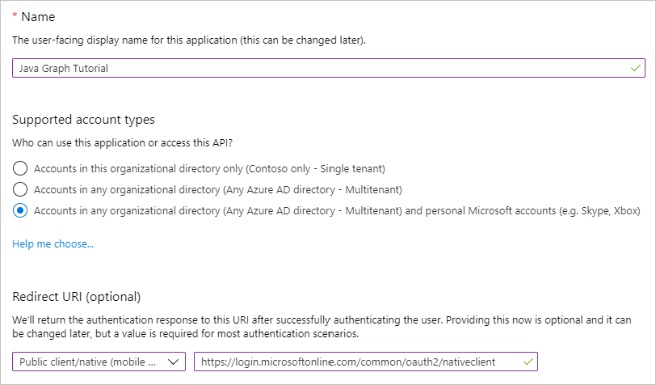
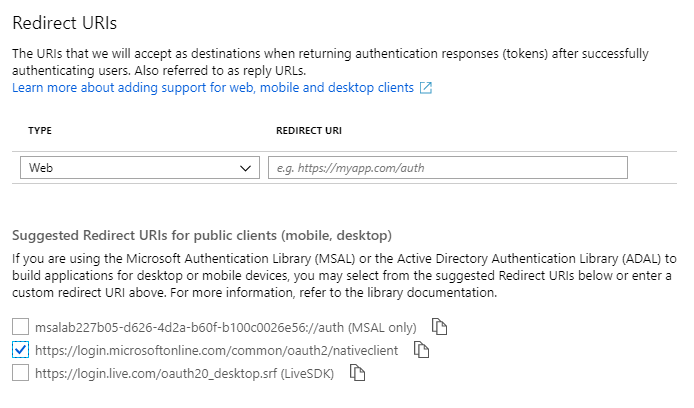

<!-- markdownlint-disable MD002 MD041 -->

In dieser Übung erstellen Sie mithilfe des Azure Active Directory Admin Center eine neue Azure AD Anwendung.

1. Öffnen Sie einen Browser, und navigieren Sie zum [Azure Active Directory Admin Center](https://aad.portal.azure.com). Melden Sie sich mit einem **persönlichen Konto** (auch: Microsoft-Konto) oder einem **Geschäfts- oder Schulkonto** an.

1. Wählen Sie in der linken Navigationsleiste **Azure Active Directory** aus, und wählen Sie dann **App** -Registrierungen unter **Manage**aus.

    

1. Wählen Sie **Neue Registrierung** aus. Legen Sie auf der Seite **Anwendung registrieren** die Werte wie folgt fest.

    - Legen Sie **Name** auf `Java Graph Tutorial` fest.
    - Legen Sie **unterstützte Kontotypen** auf **Konten in einem beliebigen Organisations Verzeichnis**fest.
    - Lassen Sie **URI umleiten** leer.

    

1. Wählen Sie **Registrieren** aus. Kopieren Sie auf der Seite **Java Graph Tutorial** den Wert der **Anwendungs-ID (Client)** , und speichern Sie ihn, die Sie im nächsten Schritt benötigen.

    

1. Klicken Sie auf den Link Umleitungs- **URI hinzufügen** . Suchen Sie auf der Seite "Umleitungs- **URIs** " den Abschnitt vorgeschlagene Umleitungs- **URIs für öffentliche Clients (Mobile, Desktop)** . Wählen Sie `https://login.microsoftonline.com/common/oauth2/nativeclient` den URI aus.

    

1. Suchen Sie den **standardmäßigen Clienttyp** Abschnitt, und ändern Sie die Option **Anwendung als öffentlichen Client** Umschalten auf **Ja**, und wählen Sie dann **Speichern**aus.

    
